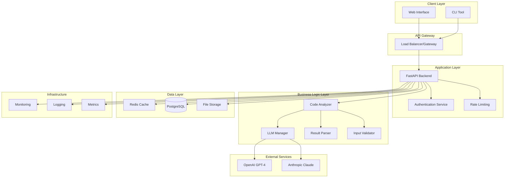
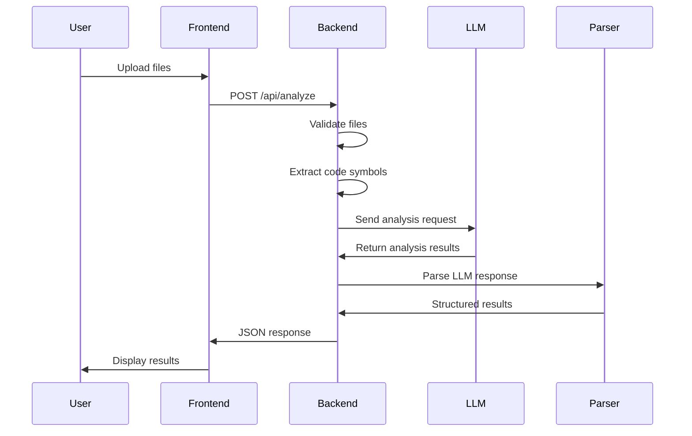
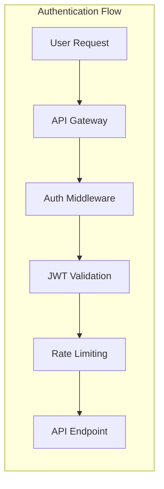
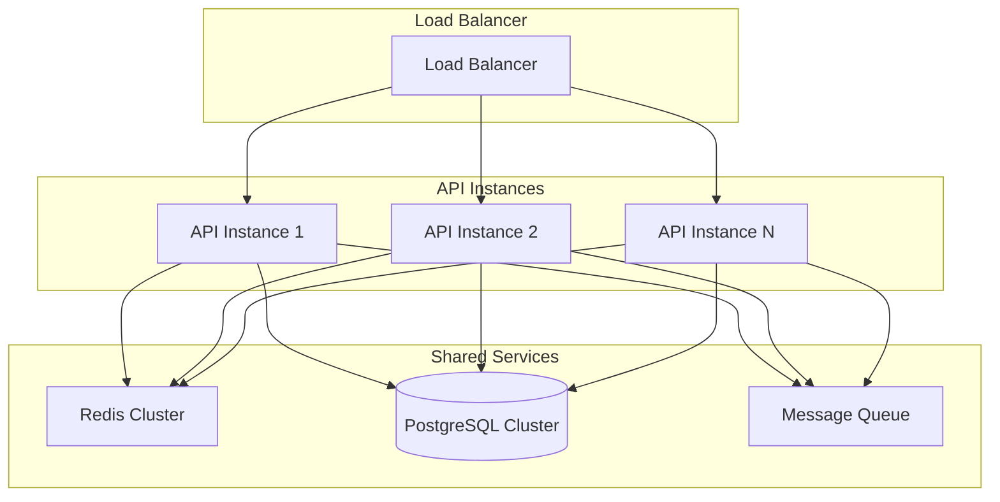
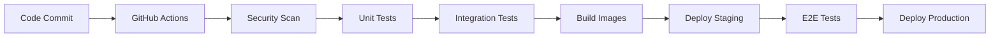

# Code Safe - Software Architecture Documentation

## Table of Contents

1. [System Overview](#system-overview)
2. [Architecture Principles](#architecture-principles)
3. [System Architecture](#system-architecture)
4. [Component Design](#component-design)
5. [Data Flow](#data-flow)
6. [Security Architecture](#security-architecture)
7. [Scalability & Performance](#scalability--performance)
8. [Deployment Architecture](#deployment-architecture)
9. [Monitoring & Observability](#monitoring--observability)
10. [Future Considerations](#future-considerations)

## System Overview

Code Safe is an AI-powered security vulnerability scanner designed to identify complex, multi-step security vulnerabilities in Python codebases. The system leverages Large Language Models (LLMs) to perform deep semantic analysis that goes beyond traditional static analysis tools.

### Key Features

- **Multi-LLM Support**: Integration with OpenAI GPT-4 and Anthropic Claude
- **7 Vulnerability Types**: RCE, SQL Injection, XSS, LFI, SSRF, AFO, IDOR
- **Confidence Scoring**: AI-powered confidence assessment (0-10 scale)
- **Detailed Analysis**: Proof-of-concept exploits and remediation guidance
- **Web Interface**: Modern React-based frontend with real-time analysis

### Technology Stack

**Backend:**
- Python 3.11+ with FastAPI
- Pydantic for data validation
- Anthropic and OpenAI SDKs
- Uvicorn ASGI server

**Frontend:**
- Next.js 14 with App Router
- TypeScript for type safety
- Tailwind CSS for styling
- Shadcn/ui component library

**Infrastructure:**
- Docker containerization
- GitHub Actions CI/CD
- Cloud deployment ready

## Architecture Principles

### 1. Security First
- Secure by design principles
- Defense in depth strategy
- Principle of least privilege
- Regular security assessments

### 2. Modularity & Separation of Concerns
- Clear separation between frontend and backend
- Modular component design
- Single responsibility principle
- Loose coupling, high cohesion

### 3. Scalability & Performance
- Horizontal scaling capabilities
- Asynchronous processing
- Efficient resource utilization
- Caching strategies

### 4. Reliability & Resilience
- Error handling and recovery
- Circuit breaker patterns
- Graceful degradation
- Health monitoring

### 5. Maintainability
- Clean code principles
- Comprehensive documentation
- Automated testing
- Continuous integration

## System Architecture



## Component Design

### Backend Components

#### 1. FastAPI Server (`server.py`)
**Responsibilities:**
- HTTP request handling
- File upload management
- API endpoint routing
- Response formatting

**Key Features:**
- CORS configuration for frontend integration
- Multipart file upload support
- Error handling and logging
- Health check endpoints

#### 2. LLM Manager (`LLMs.py`)
**Responsibilities:**
- Multi-LLM abstraction layer
- API key management
- Request/response handling
- Error recovery and retry logic

**Supported LLMs:**
- OpenAI GPT-4 (primary)
- Anthropic Claude (secondary)
- Ollama (local deployment)

#### 3. Code Analyzer (`symbol_finder.py`)
**Responsibilities:**
- Python code parsing
- Symbol extraction
- Context analysis
- Dependency resolution

#### 4. Prompt Engineering (`prompts.py`)
**Responsibilities:**
- Vulnerability-specific prompts
- Context formatting
- Response templates
- Bypass technique examples

### Frontend Components

#### 1. File Upload Component
**Features:**
- Drag-and-drop interface
- Multiple file support
- Progress tracking
- Error handling

#### 2. Vulnerability Report Component
**Features:**
- Interactive vulnerability display
- Severity classification
- Detailed analysis views
- Export functionality

#### 3. Detailed Analysis Component
**Features:**
- Executive summary dashboard
- Technical vulnerability details
- Proof-of-concept exploits
- Remediation guidance

## Data Flow

### Analysis Workflow



### Data Processing Pipeline

1. **Input Validation**
   - File type verification
   - Size limitations
   - Content sanitization

2. **Code Analysis**
   - Symbol extraction
   - Dependency mapping
   - Context building

3. **LLM Processing**
   - Prompt construction
   - API request handling
   - Response validation

4. **Result Processing**
   - Output parsing
   - Confidence scoring
   - Vulnerability classification

5. **Response Generation**
   - JSON formatting
   - Error handling
   - Caching

## Security Architecture

### Authentication & Authorization



### Security Controls

#### 1. Input Security
- File type validation
- Content sanitization
- Size limitations
- Path traversal prevention

#### 2. API Security
- JWT authentication
- Rate limiting
- CORS configuration
- Request validation

#### 3. Data Security
- Encryption at rest
- Encryption in transit
- Secure key management
- Data retention policies

#### 4. Infrastructure Security
- Container security scanning
- Network segmentation
- Security headers
- Vulnerability monitoring

### Threat Model

#### Assets
- User-uploaded code
- Analysis results
- API keys
- User data

#### Threats
- Code injection attacks
- Data exfiltration
- API abuse
- Credential theft

#### Mitigations
- Input validation
- Output encoding
- Access controls
- Monitoring & alerting

## Scalability & Performance

### Horizontal Scaling



### Performance Optimizations

#### 1. Caching Strategy
- Redis for session data
- Response caching for repeated analyses
- CDN for static assets
- Browser caching headers

#### 2. Asynchronous Processing
- Background job processing
- Queue-based architecture
- Non-blocking I/O operations
- Concurrent LLM requests

#### 3. Database Optimization
- Connection pooling
- Query optimization
- Indexing strategy
- Read replicas

#### 4. Frontend Optimization
- Code splitting
- Lazy loading
- Image optimization
- Bundle optimization

## Deployment Architecture

### Container Strategy

```dockerfile
# Multi-stage build for optimization
FROM python:3.11-slim as backend-builder
# Backend build steps...

FROM node:18-alpine as frontend-builder  
# Frontend build steps...

FROM python:3.11-slim as production
# Production image assembly...
```

### Kubernetes Deployment

```yaml
apiVersion: apps/v1
kind: Deployment
metadata:
  name: code-safe-backend
spec:
  replicas: 3
  selector:
    matchLabels:
      app: code-safe-backend
  template:
    metadata:
      labels:
        app: code-safe-backend
    spec:
      containers:
      - name: backend
        image: code-safe:latest
        ports:
        - containerPort: 8000
        env:
        - name: OPENAI_API_KEY
          valueFrom:
            secretKeyRef:
              name: api-keys
              key: openai-key
```

### CI/CD Pipeline



## Monitoring & Observability

### Metrics Collection

#### Application Metrics
- Request latency
- Error rates
- Throughput
- LLM response times

#### Business Metrics
- Analysis completion rate
- Vulnerability detection rate
- User engagement
- API usage patterns

#### Infrastructure Metrics
- CPU/Memory usage
- Network I/O
- Disk usage
- Container health

### Logging Strategy

```python
import structlog

logger = structlog.get_logger("code_safe")

# Structured logging example
logger.info(
    "Analysis completed",
    file_path=file_path,
    vulnerabilities_found=len(results),
    confidence_score=avg_confidence,
    processing_time=elapsed_time,
    llm_used=llm_choice
)
```

### Alerting Rules

#### Critical Alerts
- Service downtime
- High error rates (>5%)
- Security incidents
- API key issues

#### Warning Alerts
- High latency (>30s)
- Resource utilization (>80%)
- Failed analyses (>10%)
- Queue backlog

### Health Checks

```python
@app.get("/health")
async def health_check():
    """Comprehensive health check endpoint."""
    checks = {
        "database": check_database_connection(),
        "redis": check_redis_connection(),
        "openai": check_openai_api(),
        "anthropic": check_anthropic_api(),
        "disk_space": check_disk_space(),
        "memory": check_memory_usage()
    }
    
    all_healthy = all(checks.values())
    status_code = 200 if all_healthy else 503
    
    return JSONResponse(
        status_code=status_code,
        content={
            "status": "healthy" if all_healthy else "unhealthy",
            "checks": checks,
            "timestamp": datetime.utcnow().isoformat()
        }
    )
```

## Future Considerations

### Planned Enhancements

#### 1. Multi-Language Support
- JavaScript/TypeScript analysis
- Java vulnerability detection
- Go security scanning
- C/C++ analysis capabilities

#### 2. Advanced AI Features
- Custom model fine-tuning
- Vulnerability trend analysis
- Automated fix suggestions
- Risk scoring algorithms

#### 3. Enterprise Features
- SAML/SSO integration
- Role-based access control
- Audit logging
- Compliance reporting

#### 4. Integration Capabilities
- IDE plugins (VS Code, PyCharm)
- CI/CD integrations (Jenkins, GitLab)
- SIEM integrations
- Ticketing system integration

### Technical Debt Management

#### Code Quality
- Regular refactoring cycles
- Technical debt tracking
- Code review processes
- Automated quality gates

#### Performance Optimization
- Regular performance audits
- Bottleneck identification
- Optimization roadmap
- Capacity planning

#### Security Updates
- Regular dependency updates
- Security patch management
- Vulnerability assessments
- Penetration testing

### Scalability Roadmap

#### Phase 1: Current (1-1000 users)
- Single region deployment
- Basic monitoring
- Manual scaling

#### Phase 2: Growth (1K-10K users)
- Multi-region deployment
- Auto-scaling
- Advanced monitoring
- CDN integration

#### Phase 3: Scale (10K+ users)
- Microservices architecture
- Event-driven design
- Advanced caching
- Global distribution

---

This architecture documentation serves as a living document that evolves with the system. Regular reviews and updates ensure it remains accurate and useful for development, operations, and security teams.
